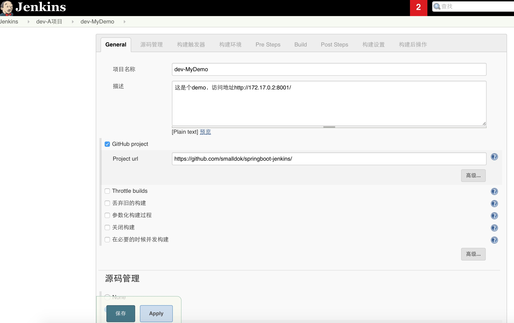
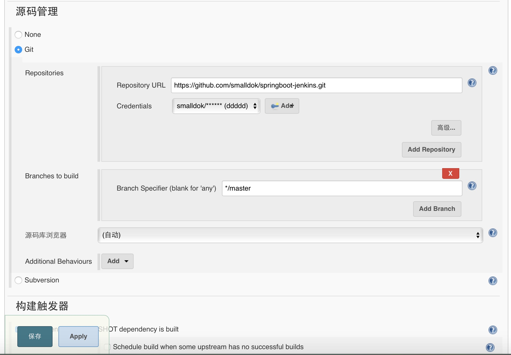
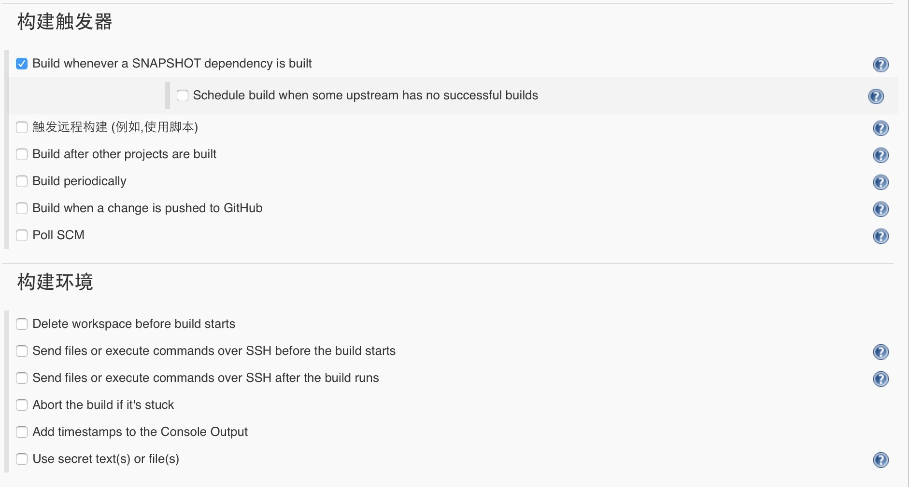
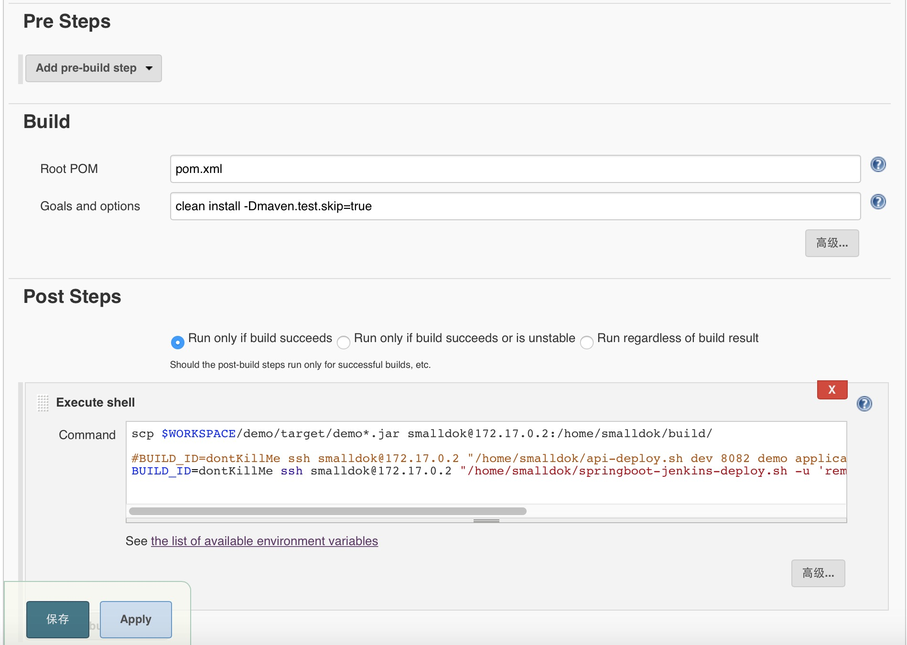

# springboot-jenkins
jenkins 构建、打包、远程部署springboot项目

## 远程部署（JAR包）
远程部署的目标服务器上，一般都会有一个shell部署脚本给jenkins远程调用，它所做的事情大致如下：    
1、停止正在运行的服务(kill -9)  
2、备份（xxx.jar.20170714125400）  
3、删除发布目录中的jar文件  
4、拷贝新的jar文件到发布目录中  
5、启动项目 (java -jar)  
6、监听启动日志(tail -f)  

远程部署的目录结构：
```
--spring-boot-demo
----dev
-------my-app.jar
-------initServer.log

----test
-------my-app.jar
-------initServer.log

----prod
-------my-app.jar
-------initServer.log
```
项目打包后的目录结构：
```
分为两种，第一种是分离方式，第二种配置、lib都在一个jar包里；
第一种：
--my-project
----bin
-------startup.sh
----conf
-------application.properties
----log
-------app.log
----lib
-------my-app.jar
-------xxx.jar
-------xxx.jar
第二种(本例子是这种)：
-------my-app.jar

```
jenkins 中设置 `Post Steps` Execute shell:
``` java
scp $WORKSPACE/demo/target/demo*.jar smalldok@172.17.0.2:/home/smalldok/build/
BUILD_ID=dontKillMe ssh smalldok@172.17.0.2 "/home/smalldok/springboot-jenkins-deploy.sh -u 'remote://127.0.0.1:8001/demo?profile=dev&enable_debug=false&enable_jmx=false'"
```
springboot-jenkins-deploy.sh的传参采用URL方式(参考的dubbo url设计);  
URL中协议头、IP这两个参数暂时还没什么用，供以后扩展吧；

部署shell脚本：
springboot-jenkins-deploy.sh
``` java
#!/bin/sh
#local://127.0.0.1:8001/springboot-demo?profile=dev&enable_debug=false&enable_jmx=false
#remote://127.0.0.1:8001/springboot-demo?profile=dev&enable_debug=false&enable_jmx=false

protocol=""
ip=""
port=""
context_path=""
queryStr=""
profile="dev"
enable_debug="false"
enable_jmx="false"
function help()
{
cat <<HELP
NAME: springboot-jenkins-deploy.sh - springboot project deploy  
USAGE: springboot-jenkins-deploy.sh [-u url]
EXAMPLE: 
	*-deploy -u local://127.0.0.1:8001/springboot-demo?profile=dev
	or
	*-deploy.sh -u remote://10.1.34.27:8001/springboot-demo?profile=dev
HELP
exit 0
}

function getProtocolForUrl(){
   protocol=`echo $1 | awk -F'[://]' '{print $1}'`
   #echo $protocol
   if [ $protocol != "local" -a $protocol != "remote" ];then
   	echo "error protocol[$protocol]."
	exit 1
   fi   
}
function valid_ip(){
   if [[ "$1" =~ ^[0-9]{1,3}\.[0-9]{1,3}\.[0-9]{1,3}\.[0-9]{1,3}$ ]] ;then  
        return 0  
   else  
        return 1  
   fi
} 
function getIpForUrl(){
   ip=`echo $1 | awk -F'[/:]' '{print $4}'`
   echo $ip
   valid_ip $ip
   isValid=`echo $?`
   if [ "$ip" != "localhost" -a $isValid != "0" ];then
   	echo "error ip[$ip]."
	exit 1
   fi
}
function getPortForUrl(){
   port=`echo $1 | awk -F'[/:]' '{print $5}'`
   echo $port
}
function getContextPathForUrl(){
   context_path=`echo $1 | awk -F'[/?]' '{print $4}'`
   echo $context_path
}
function getQueryStrForUrl(){
   queryStr=`echo $1 | awk -F'?' '{print $2}'`
   echo $queryStr
}
function parseQueryStr(){
	profile=`echo $queryStr | grep -Po '(profile=)\K[^&]+'`
	enable_debug=`echo $queryStr | grep -Po '(enable_debug=)\K[^&]+'`
	enable_jmx=`echo $queryStr | grep -Po '(enable_jmx=)\K[^&]+'`
}
function parseUrl(){
   getProtocolForUrl $1;
   getIpForUrl $1;
   getPortForUrl $1;
   getContextPathForUrl $1;
   getQueryStrForUrl $1;
   parseQueryStr;
}

if [ -z "$1" ];then
 echo "error:no such option $1. try 'deploy.sh -h' for more information"
else
# while [ -n "$1" ];do
 case $1 in
    -h) help;;
    -u) 
	parseUrl $2;
	;;
    *) 
	echo "error:no such option $1. try 'deploy.sh -h' for more information";	exit 1;
	;;
 esac
 #done
fi

#####################################################################################################################
# COMMAND LINE VARIABLES
#enviroment FIRST ARGUMENT 
# Ex: dev | sit | uat
env=$profile
# deploy port SECOND ARGUMENT
# Ex: 8090 | 8091 | 8092 
serverPort=$port
# THIRD ARGUMENT project name, deploy folder name and jar name
projectName=$context_path
# FOURTH ARGUMENT external config file name
# Ex: application-localhost.yml
configFile=""


#### CONFIGURABLE VARIABLES ######
#destination absolute path. It must be pre created or you can
# improve this script to create if not exists
destAbsPath=/home/smalldok/release/$projectName/$env
backupPath=/home/smalldok/backup
#configFolder=resources
##############################################################

#####
##### DONT CHANGE HERE ##############
#jar file
# $WORKSPACE is a jenkins var
#sourFile=$WORKSPACE/api/build/libs/$projectName*.jar
sourFile=/home/smalldok/build/$projectName*.jar
destFile=$destAbsPath/$projectName.jar

#config files folder
#sourConfigFolder=$WORKSPACE/$configFolder*
#destConfigFolder=$destAbsPath/$configFolder

#properties=--spring.config.location=$destAbsPath/$configFolder/$configFile
properties="--server.port=$serverPort --spring.profiles.active=$env"

#CONSTANTS
logFile=initServer.log
dstLogFile=$destAbsPath/$logFile
#whatToFind="Started Application in"
whatToFind="Started "
msgLogFileCreated="$logFile created"
msgBuffer="Buffering: "
msgAppStarted="Application Started... exiting buffer!"

### FUNCTIONS
##############
function stopServer(){
    echo " "
    echo "Stoping process on port: $serverPort"
	pid=`ps -ef | grep $projectName.jar | grep -v grep | awk '{print $2}'`
	if [ -n "$pid" ]
	then
	   kill -9 $pid
	fi
    echo " "
}
backupFile=""
function backup(){
	echo " "
	if [ -f "$destFile" ]
	then
	   backupFile="$backupPath/$projectName.jar.`date +%Y%m%d%H%M%S`"
	   cp $destFile $backupFile
	   echo "backup [$destFile] -> [$backupFile]"
	fi
	echo " "
}
function deleteFiles(){
    echo "Deleting $destFile"
    rm -rf $destFile
    #echo "Deleting $destConfigFolder"
    #rm -rf $destConfigFolder
    echo "Deleting $dstLogFile"
    rm -rf $dstLogFile
    echo " "
}

function copyFiles(){
    echo "Copying files from $sourFile"
    cp $sourFile $destFile
    #echo "Copying files from $sourConfigFolder"
    #cp -r $sourConfigFolder $destConfigFolder
    echo " "
}

JAVA_OPTS=""
JAVA_MEM_OPTS=""
JAVA_DEBUG_OPTS=""
JAVA_JMX_OPTS=""
function run(){
	JAVA_OPTS=" -Djava.awt.headless=true -Djava.net.preferIPv4Stack=true"
	JAVA_MEM_OPTS=""
	BITS=`java -version 2>&1 | grep -i 64-bit`
	if [ -n "$BITS" ]; then
		JAVA_MEM_OPTS=" -server -Xmx1g -Xms1g -Xmn512m -XX:PermSize=512m -Xss256k -XX:+DisableExplicitGC -XX:+UseConcMarkSweepGC -XX:+CMSParallelRemarkEnabled -XX:+UseCMSCompactAtFullCollection -XX:LargePageSizeInBytes=128m -XX:+UseFastAccessorMethods -XX:+UseCMSInitiatingOccupancyOnly -XX:CMSInitiatingOccupancyFraction=70 "
	else
		JAVA_MEM_OPTS=" -server -Xms1g -Xmx2g -XX:PermSize=1024m -XX:SurvivorRatio=2 -XX:+UseParallelGC "
	fi
	JAVA_DEBUG_OPTS=""
	if [ "$enable_debug" = "true" ]; then
		JAVA_DEBUG_OPTS=" -Xdebug -Xnoagent -Djava.compiler=NONE -Xrunjdwp:transport=dt_socket,address=5566,server=y,suspend=n "
	fi
	JAVA_JMX_OPTS=""
	if [ "$enable_jmx" = "true" ]; then
		JAVA_JMX_OPTS=" -Dcom.sun.management.jmxremote.port=1099 -Dcom.sun.management.jmxremote.ssl=false -Dcom.sun.management.jmxremote.authenticate=false "
	fi
   #echo "java -jar $destFile $properties" | at now + 1 minutes
   touch $dstLogFile | chmod 777 $dstLogFile
   nohup nice java $JAVA_OPTS $JAVA_MEM_OPTS $JAVA_DEBUG_OPTS $JAVA_JMX_OPTS -jar $destFile $properties $> $dstLogFile 2>&1 &
   echo "COMMAND: nohup nice java -jar $destFile $properties $> $dstLogFile 2>&1 &"
   echo " "
}
function changeFilePermission(){
    echo "Changing File Permission: chmod 777 $destFile"
    chmod 777 $destFile
    echo " "
}   

function watch(){
    tail -f $dstLogFile |
        while IFS= read line
        do
            echo "$msgBuffer" "$line"

            if [[ "$line" == *"$whatToFind"* ]]; then
                echo $msgAppStarted
                pkill  tail
            fi
        done
}

### FUNCTIONS CALLS
#####################
# Use Example of this file. Args: enviroment | port | project name | external resourcce
# BUILD_ID=dontKillMe /path/to/this/file/api-deploy.sh dev 8082 spring-boot application-localhost.yml

# 1 - stop server on port ...
stopServer
backup
# 2 - delete destinations folder content
deleteFiles

# 3 - copy files to deploy dir
copyFiles

changeFilePermission
# 4 - start server
run

# 5 - watch loading messages until  ($whatToFind) message is found
watch
```
jenkins 配置截图





参考：https://github.com/rcoli/spring-boot-jenkins.git